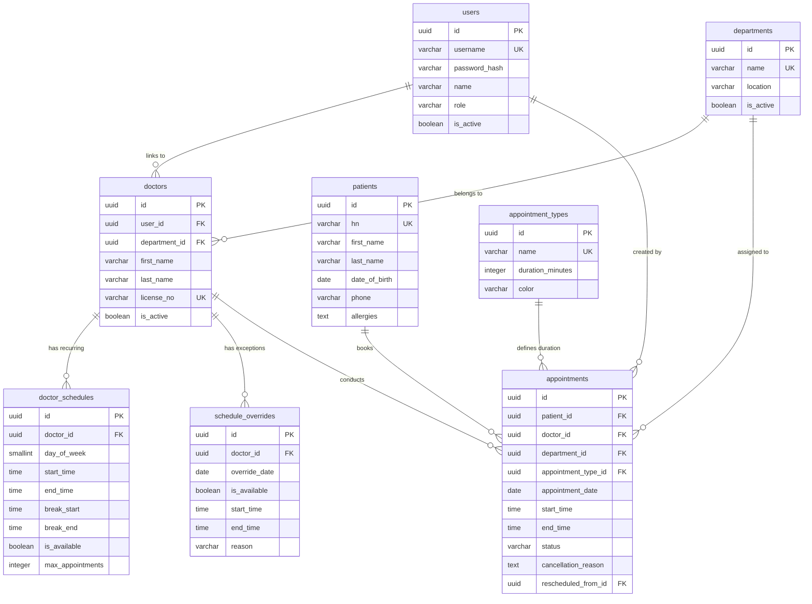

# 🏥 ระบบจัดการนัดหมายผู้ป่วยนอก (Hospital Outpatient Appointment Booking Module)

ระบบจัดการนัดหมายผู้ป่วยนอกแบบ Full-stack สำหรับเจ้าหน้าที่โรงพยาบาล (Receptionist/Admin) รองรับตารางเวลาแพทย์แบบรายสัปดาห์และตารางยกเว้นรายวัน (Overrides), การคำนวณ Slot ว่างอัตโนมัติตามระยะเวลาของแต่ละประเภทนัดหมาย, การป้องกันการจองซ้อนด้วย Pessimistic Locking และการจัดการวงจรสถานะการนัดหมาย (Status Lifecycle)

---

## 📌 สารบัญ

- [ภาพรวมโปรเจกต์](#-ภาพรวมโปรเจกต์)
- [ฟีเจอร์หลัก](#-ฟีเจอร์หลัก)
- [Business Logic & การออกแบบระบบ](#-business-logic--การออกแบบระบบ)
  - [1. อัลกอริทึมคำนวณช่วงเวลาว่าง (Slot Availability)](#1-อัลกอริทึมคำนวณช่วงเวลาว่าง-slot-availability)
  - [2. ขั้นตอนการตรวจสอบการจอง (11-Step Validation)](#2-ขั้นตอนการตรวจสอบการจอง-11-step-validation)
  - [3. การป้องกัน Race Condition (Concurrency Control)](#3-การป้องกัน-race-condition-concurrency-control)
  - [4. วงจรสถานะการนัดหมาย (Appointment Status Lifecycle)](#4-วงจรสถานะการนัดหมาย-appointment-status-lifecycle)
  - [5. นโยบายยกเลิกและเลื่อนนัด (Cancel & Reschedule)](#5-นโยบายยกเลิกและเลื่อนนัด-cancel--reschedule)
- [Tech Stack](#-tech-stack)
- [โครงสร้างโปรเจกต์](#-โครงสร้างโปรเจกต์)
- [เริ่มต้นใช้งานด้วย Docker (แนะนำ)](#-เริ่มต้นใช้งานด้วย-docker-แนะนำ)
- [การติดตั้งแบบ Local Development](#-การติดตั้งแบบ-local-development)
- [บัญชีผู้ใช้ทดสอบ (Demo Accounts)](#-บัญชีผู้ใช้ทดสอบ-demo-accounts)
- [REST API Endpoints & สิทธิ์การใช้งาน](#-rest-api-endpoints--สิทธิ์การใช้งาน)
- [Database Schema & ERD](#-database-schema--erd)
- [การทดสอบระบบ (Testing)](#-การทดสอบระบบ-testing)
- [ข้อสมมติฐานและข้อจำกัด (Assumptions & Limitations)](#-ข้อสมมติฐานและข้อจำกัด-assumptions--limitations)
- [ภาพตัวอย่างหน้าจอ (Screenshots)](#-ภาพตัวอย่างหน้าจอ-screenshots)

---

## 📖 ภาพรวมโปรเจกต์

ระบบนี้พัฒนาขึ้นเพื่อแก้ปัญหาความซับซ้อนในการนัดหมายผู้ป่วยนอกของโรงพยาบาล โดยมีจุดเด่นสำคัญ:
1. **Dynamic Schedule Matching**: รวมตารางเวรปกติ (Weekly Schedule) กับตารางยกเว้น (Overrides เช่น วันลา/เวรพิเศษ) แบบ Real-time
2. **Duration-based Slot Slicing**: ซอยช่วงเวลาว่างตามความยาวของประเภทการรักษา (15, 20, 30, 45 นาที) พร้อมตัดช่วงพักเบรก (Break Time) อัตโนมัติ
3. **Pessimistic Concurrency Locking**: ป้องกันปัญหาการกดจองเวลาเดียวกันพร้อมกัน (Race Condition / Double Booking) ด้วย `SELECT ... FOR UPDATE` ระดับแถวใน Database Transaction
4. **Complete Status Lifecycle**: จัดการสถานะตั้งแต่จอง ยืนยัน เข้ารับการตรวจ ไปจนถึงตรวจเสร็จ หรือการยกเลิก/เลื่อนนัด

---

## ✨ ฟีเจอร์หลัก

| ระบบ | รายละเอียดการทำงาน |
|---|---|
| **ตารางเวลาแพทย์ (Schedules)** | จัดการตารางเวลาประจำสัปดาห์ (จันทร์-อาทิตย์), กำหนดเวลาเริ่ม-เลิก, เวลาพักเบรก, เปิด-ปิดรับนัด และกำหนดเพดานรับคนไข้รายวัน (`max_appointments`) |
| **ตารางยกเว้นรายวัน (Overrides)** | บันทึกวันหยุด ลาประชุมวิชาการ หรือเปิดคลินิกพิเศษนอกเวลา ซึ่งจะมีผลทับตารางประจำสัปดาห์โดยอัตโนมัติ |
| **ประเภทการนัดหมาย (Appointment Types)** | กำหนดประเภทการตรวจพร้อมระยะเวลาที่ใช้ (เช่น New Patient 30 นาที, Follow-up 15 นาที, Procedure 45 นาที) และแท็กสีสำหรับ UI |
| **ค้นหา Slot ว่าง (Slot Finder)** | คำนวณช่วงเวลาว่างของแพทย์ตามวันที่และประเภทนัดหมาย ไม่แสดงเวลาที่ถูกจองแล้ว ช่วงพักเบรก และเวลาที่เลยมาแล้ว |
| **ระบบจองที่ปลอดภัย (Booking Engine)** | ตรวจสอบเงื่อนไขอย่างเข้มงวด 11 ขั้นตอน ป้องกันการจองย้อนหลัง จองนอกเวลา หรือจองชนคิว |
| **วงจรสถานะ (Lifecycle Management)** | อัปเดตสถานะ: `Booked` ➔ `Confirmed` ➔ `Checked-in` ➔ `In Progress` ➔ `Completed` (รวมถึง `Cancelled`, `No-show`, `Rescheduled`) |
| **ยกเลิกและเลื่อนนัด (Cancel & Reschedule)** | บันทึกเหตุผลการยกเลิกและคืน Slot ทันที พร้อมระบบ Reschedule แบบ Atomic Transaction เชื่อมโยงประวัตินัดเดิม |
| **ทะเบียนผู้ป่วย (Patient Directory)** | บันทึกข้อมูลคนไข้ สร้างรหัส HN อัตโนมัติ (`HN-XXXXXX`), ข้อมูลแพ้ยา และดูประวัติการนัดหมายย้อนหลัง |
| **Dashboard สรุปภาพรวม** | สรุปสถิติประจำวัน, จำนวนแพทย์ที่เข้าตรวจ, จำนวนคิวแยกตามสถานะ และตารางคิวแบบ Real-time |
| **ระบบสิทธิ์ (RBAC & Auth)** | แบ่งสิทธิ์การใช้งาน (`Admin`, `Receptionist`, `Doctor`) ด้วย JWT และ Refresh Token Rotation ผ่าน HTTP-Only Cookies |

---

## 🧠 Business Logic & การออกแบบระบบ

### 1. อัลกอริทึมคำนวณช่วงเวลาว่าง (Slot Availability)

```
[ระบุ: แพทย์ + วันที่ + ประเภทการนัดหมาย]
                       │
                       ▼
         ┌───────────────────────────┐
         │ ตรวจสอบ Schedule Override │
         └─────────────┬─────────────┘
                       │
         ┌─────────────┴─────────────┐
   [มี Override รายวัน]        [ไม่มี Override]
         │                            │
  ┌──────┴──────┐              ┌──────┴──────┐
  │ is_available│              │ ดึงตารางเวร │
  │ = false?    │              │ รายสัปดาห์  │
  └──────┬──────┘              └──────┬──────┘
         ├────────[จริง]──▶ (คืนค่า: ไม่มี Slot ว่าง แพทย์ลา/ปิดตรวจ)
         │
  [ใช้เวลาตาม Override]        [ใช้เวลาตามตารางสัปดาห์]
         │                            │
         └─────────────┬──────────────┘
                       │
                       ▼
         ┌───────────────────────────┐
         │ สร้าง Candidate Slots     │ (ขยับทีละ duration_minutes)
         │ ไม่รวมช่วงพักเบรก (Break)  │
         └─────────────┬─────────────┘
                       │
                       ▼
         ┌───────────────────────────┐
         │ กรองการจองที่ active ออก │ (status NOT IN ('cancelled', 'rescheduled'))
         └─────────────┬─────────────┘
                       │
                       ▼
         ┌───────────────────────────┐
         │ กรองเวลาที่ผ่านไปแล้วออก  │ (กรณีเป็นวันปัจจุบัน และเวลา <= เวลาปัจจุบัน + 1 ชม.)
         └─────────────┬─────────────┘
                       │
                       ▼
            [คืนค่ารายการ Slot ที่ว่าง]
```

---

### 2. ขั้นตอนการตรวจสอบการจอง (11-Step Validation)

ทุกคำขอการจองต้องผ่านการตรวจสอบตามลำดับดังนี้:

| ลำดับ | กฎการตรวจสอบ | รหัสข้อผิดพลาด | HTTP Status |
|---|---|---|---|
| **1** | วันที่นัดหมายต้องไม่เป็นอดีต | `PAST_DATE` | `400 Bad Request` |
| **2** | ต้องจองล่วงหน้าอย่างน้อย 1 ชั่วโมง (`MIN_ADVANCE_HOURS = 1`) | `TOO_LATE` | `400 Bad Request` |
| **3** | แพทย์ต้องมีตารางตรวจในวันที่เลือก | `NO_SCHEDULE` | `400 Bad Request` |
| **4** | สถานะตารางแพทย์ต้องเปิดให้จอง (`is_available = true`) | `SCHEDULE_UNAVAILABLE` | `400 Bad Request` |
| **5** | เวลาที่จองต้องอยู่ในช่วงเวลาทำงานของแพทย์ | `OUTSIDE_WORKING_HOURS` | `400 Bad Request` |
| **6** | เวลาที่จองต้องไม่ตรงกับเวลาพักเบรกของแพทย์ | `DURING_BREAK` | `400 Bad Request` |
| **7** | เวลาที่จองต้องไม่ชนกับนัดหมายอื่นของแพทย์ที่ยัง Active | `SLOT_TAKEN` | `409 Conflict` |
| **8** | ข้อมูลแพทย์ต้องเปิดใช้งานอยู่ในระบบ (`is_active = true`) | `DOCTOR_INACTIVE` | `400 Bad Request` |
| **9** | ข้อมูลผู้ป่วยต้องเปิดใช้งานอยู่ในระบบ (`is_active = true`) | `PATIENT_INACTIVE` | `400 Bad Request` |
| **10** | ประเภทการนัดหมายต้องเปิดใช้งานอยู่ (`is_active = true`) | `TYPE_INACTIVE` | `400 Bad Request` |
| **11** | จำนวนนัดหมายในวันนั้นต้องไม่เกินโควตาสูงสุด (`max_appointments`) | `MAX_APPOINTMENTS_REACHED` | `409 Conflict` |

---

### 3. การป้องกัน Race Condition (Concurrency Control)

ใช้เทคนิค **Pessimistic Row-Level Locking (`SELECT ... FOR UPDATE`)** ภายใน Database Transaction:

```typescript
await knex.transaction(async (trx) => {
  // 1. ล็อกแถวข้อมูลแพทย์เพื่อจัดลำดับการประมวลผลคำขอที่เข้ามาพร้อมกัน
  const doctor = await trx('doctors')
    .where({ id: doctorId })
    .forUpdate()
    .first();

  // 2. ตรวจสอบว่ามีนัดหมายอื่นทับซ้อนเวลาหรือไม่
  const conflicting = await trx('appointments')
    .where({ doctor_id: doctorId, appointment_date: date })
    .whereNotIn('status', ['cancelled', 'rescheduled'])
    .where('start_time', '<', endTime)
    .where('end_time', '>', startTime)
    .first();

  if (conflicting) {
    throw new AppError('This appointment slot is already booked', 409, 'SLOT_TAKEN');
  }

  // 3. บันทึกข้อมูลการนัดหมาย
  const [appointment] = await trx('appointments').insert(payload).returning('*');
  return appointment;
});
```

---

### 4. วงจรสถานะการนัดหมาย (Appointment Status Lifecycle)

```
                    ┌──────────────┐
              ┌────▶│  cancelled   │ (คืน Slot ให้ผู้อื่นจองได้ทันที)
              │     └──────────────┘
              │
┌────────┐    │     ┌──────────────┐     ┌──────────────┐     ┌──────────────┐     ┌──────────────┐
│ booked │────┼────▶│  confirmed   │────▶│  checked_in  │────▶│ in_progress  │────▶│  completed   │
└────────┘    │     └──────┬───────┘     └──────┬───────┘     └──────────────┘     └──────────────┘
              │            │                    │
              │            │                    ▼
              │            │             ┌──────────────┐
              │            └────────────▶│   no_show    │ (ยังคงล็อก Slot ไว้)
              │                          └──────────────┘
              │
              │     ┌──────────────┐
              └────▶│ rescheduled  │ (คืน Slot เดิม และสร้างรายการนัดหมายใหม่)
                    └──────────────┘
```

- **สถานะที่ล็อก Slot**: `booked`, `confirmed`, `checked_in`, `in_progress`, `completed`, `no_show`
- **สถานะที่คืน Slot**: `cancelled`, `rescheduled` (ถูกตัดออกจากเงื่อนไขการค้นหา Slot ว่าง)

---

### 5. นโยบายยกเลิกและเลื่อนนัด (Cancel & Reschedule)

- **การยกเลิกนัด (Cancel)**: ทำได้เฉพาะนัดหมายสถานะ `booked` หรือ `confirmed`, บังคับระบุเหตุผล (`cancellation_reason`), บันทึกผู้กดยกเลิกและเวลา, และคืน Slot ว่างให้ผู้อื่นทันที
- **การเลื่อนนัด (Reschedule)**: ทำงานแบบ Atomic Transaction — ปรับนัดเดิมเป็น `rescheduled` และสร้างนัดใหม่โดยใส่ `rescheduled_from_id` เชื่อมโยงรายการเดิม พร้อมเข้าสู่กระบวนการตรวจเงื่อนไข 11 ขั้นตอนใหม่อีกครั้ง

---

## 🛠 Tech Stack

- **Backend**: Node.js (LTS), Express 5.x, TypeScript, PostgreSQL 16 (Timezone: `Asia/Bangkok`), Knex.js (Query Builder & Migrations), Zod (Validation), JWT + Refresh Token (HTTP-Only Cookies), Bcryptjs, Helmet, CORS
- **Frontend**: Next.js 16 (App Router), React 19, TypeScript, Tailwind CSS v4, TanStack Query v5 (React Query), Zustand, Axios, Lucide React
- **Testing**: Vitest, Supertest, Testing Library, JSDOM
- **DevOps**: Docker, Docker Compose (Multi-stage builds)

---

## 📁 โครงสร้างโปรเจกต์

```
Appointment-Booking-Module/
├── docker-compose.yml              # ตั้งค่ารัน Multi-container (DB, API, Web)
├── .env.docker                     # Environment สำหรับ Docker Compose
├── backend/
│   ├── migrations/                 # ไฟล์ Migration ทั้ง 8 ตาราง
│   ├── seeds/                      # ข้อมูลเริ่มต้นสำหรับทดสอบระบบ
│   └── src/
│       ├── app.ts                  # Express App Entry Point
│       ├── config/                 # การอ่าน Env และ Response Formatter
│       ├── middleware/             # Authenticate, Authorize, Error Handler
│       ├── api/                    # โมดูลระบบ (Routes, Controller, Service, Schema)
│       │   ├── auth/
│       │   ├── departments/
│       │   ├── doctors/
│       │   ├── patients/
│       │   ├── appointment-types/
│       │   ├── schedules/
│       │   ├── overrides/
│       │   ├── appointments/
│       │   └── dashboard/
│       └── test/                   # Integration Test ทั้งหมด 9 ชุด
└── frontend/
    ├── app/                        # Next.js App Router (Dashboard, Auth, Pages)
    └── src/
        ├── api/                    # API Client สำหรับเรียก Backend
        ├── components/             # Reusable UI Components & Modals
        └── hooks/                  # React Query Hooks
```

---

## 🚀 เริ่มต้นใช้งานด้วย Docker (แนะนำ)

สั่งรันทั้งระบบ (PostgreSQL + Backend API + Frontend) ด้วยคำสั่งเดียว:

```bash
# 1. Clone โปรเจกต์
git clone https://github.com/warutboom100/Appointment-Booking-Module.git
cd Appointment-Booking-Module

# 2. Build และ Start คอนเทนเนอร์
docker compose up --build
```

เมื่อทำงานเสร็จสมบูรณ์ สามารถเข้าใช้งานได้ที่:
- 🌐 **Frontend (Web App)**: [http://localhost:3000](http://localhost:3000)
- 🔌 **Backend (REST API)**: [http://localhost:4000/api/v1](http://localhost:4000/api/v1)
- 🗄 **PostgreSQL Database**: `localhost:5432` (`appointment_db`)

*(ระบบจะรัน Migration และ Seed ข้อมูลเริ่มต้นให้โดยอัตโนมัติ)*

---

## 💻 การติดตั้งแบบ Local Development

### ความต้องการของระบบ
- **Node.js**: v20 ขึ้นไป
- **PostgreSQL**: v16 ทำงานอยู่ที่ Local Port 5432

### 1. ฝั่ง Backend

```bash
cd backend

# ติดตั้ง Dependencies
npm install

# คัดลอกไฟล์ Environment
cp .env.example .env

# รัน Migration และ Seed ข้อมูล
npm run migrate
npm run seed

# รัน Backend เซิร์ฟเวอร์
npm run dev
```
*(Backend ทำงานที่ [http://localhost:4000](http://localhost:4000))*

### 2. ฝั่ง Frontend

```bash
cd ../frontend

# ติดตั้ง Dependencies
npm install

# คัดลอกไฟล์ Environment
cp .env.example .env

# รัน Next.js เซิร์ฟเวอร์
npm run dev
```
*(Frontend ทำงานที่ [http://localhost:3000](http://localhost:3000))*

---

## 👥 บัญชีผู้ใช้ทดสอบ (Demo Accounts)

| Username | Password | Role | สิทธิ์การใช้งาน |
|---|---|---|---|
| `admin` | `password123` | `admin` | สิทธิ์สูงสุด จัดการ Master Data, หมอ, แผนก, ตารางตรวจ, ตั้งค่าระบบ |
| `receptionist1` | `password123` | `receptionist` | เจ้าหน้าที่เวชระเบียน ลงทะเบียนคนไข้, จอง/เลื่อน/ยกเลิกนัด, เช็คอินคนไข้ |
| `dr_somchai` | `password123` | `doctor` | แพทย์ (อายุรกรรม) ดูตารางตรวจ คิวคนไข้ และอัปเดตสถานะตรวจเสร็จ |
| `dr_natthapong` | `password123` | `doctor` | แพทย์ (โรคหัวใจ) |
| `dr_wipawan` | `password123` | `doctor` | แพทย์ (ออร์โธปิดิกส์) |

---

## 🔌 REST API Endpoints & สิทธิ์การใช้งาน

**Base URL**: `http://localhost:4000/api/v1`

### 1. ระบบยืนยันตัวตน (Authentication)
- `POST /auth/login` - เข้าสู่ระบบ (Public)
- `POST /auth/register` - สร้างผู้ใช้งานใหม่ (Admin)
- `POST /auth/refresh` - ขอ Access Token ใหม่ผ่าน Cookie (Public)
- `POST /auth/logout` - ออกจากระบบ (Authenticated)
- `GET /auth/me` - ดูข้อมูลโปรไฟล์ปัจจุบัน (Authenticated)

### 2. ระบบนัดหมาย (Appointments)
- `GET /appointments/available-slots` - ค้นหา Slot ว่างตามแพทย์, วันที่ และประเภทนัดหมาย
- `POST /appointments` - จองนัดหมายใหม่ (ผ่าน 11 ขั้นตอน Validation & Lock แถว)
- `GET /appointments` - ค้นหารายการนัดหมาย (Filter ตามวันที่, แพทย์, คนไข้, สถานะ)
- `GET /appointments/:id` - ดูรายละเอียดนัดหมาย
- `PATCH /appointments/:id/status` - เปลี่ยนสถานะนัดหมาย (`confirmed`, `checked_in`, `in_progress`, `completed`, `no_show`)
- `PATCH /appointments/:id/cancel` - ยกเลิกนัดหมาย (บังคับระบุเหตุผล)
- `POST /appointments/:id/reschedule` - เลื่อนนัดหมาย (Atomic Cancel + Create ใหม่)

### 3. ตารางเวลาแพทย์ (Schedules & Overrides)
- `GET /doctors/:doctorId/schedules` - ดูตารางเวลาประจำสัปดาห์
- `POST /doctors/:doctorId/schedules` - เพิ่มตารางเวลาแพทย์ (ตรวจสอบการซ้อนทับอัตโนมัติ)
- `PATCH /schedules/:id` - แก้ไขตารางเวลา
- `DELETE /schedules/:id` - ลบตารางเวลา
- `GET /overrides` - ดูรายการวันหยุด/ตารางพิเศษรายวัน
- `POST /doctors/:doctorId/overrides` - กำหนดวันหยุดแพทย์หรือเวลาตรวจพิเศษ
- `DELETE /overrides/:id` - ลบ Override (กลับไปใช้ตารางประจำสัปดาห์)

### 4. ผู้ป่วยและข้อมูลหลัก (Patients & Master Data)
- `GET /patients` - ค้นหาผู้ป่วย (ค้นด้วยชื่อ, HN, เบอร์โทร, เลขบัตรประชาชน)
- `POST /patients` - ลงทะเบียนผู้ป่วยใหม่ (สร้าง `HN-XXXXXX` อัตโนมัติ)
- `GET /patients/:id/appointments` - ดูประวัตินัดหมายย้อนหลังของผู้ป่วย
- `GET /doctors` | `POST /doctors` | `PATCH /doctors/:id` - จัดการข้อมูลแพทย์
- `GET /departments` | `POST /departments` - จัดการแผนก
- `GET /appointment-types` - ดูและจัดการประเภทการนัดหมาย
- `GET /dashboard/summary` - สรุปสถิติประจำวันและคิวคนไข้วันนี้

---

## 🗄 Database Schema & ERD



### เหตุผลที่เลือกใช้ PostgreSQL & Knex.js
1. **ACID Transactions & Row-Level Lock**: ความจำเป็นในการใช้ `SELECT ... FOR UPDATE` เพื่อแก้ปัญหา Concurrency Double Booking
2. **PostgreSQL Sequences**: สร้างเลข HN ต่อเนื่องแบบ Atomic ปลอดภัยจากการชนกัน
3. **Strict Constraints & Types**: รองรับ Data Type แบบ `TIME`, `DATE`, `UUID` และ `CHECK` constraints ช่วยคุมความถูกต้องของข้อมูลตั้งแต่ชั้น Database
4. **Knex.js**: ควบคุม Database Migration และ Seed แบบ Type-safe พร้อมรองรับ Connection Pooling และการแยก Test Environment ด้วย `TRUNCATE CASCADE`

---

## 🧪 การทดสอบระบบ (Testing)

โปรเจกต์มีชุดทดสอบ Integration Tests ครอบคลุมทุก Business Logic สำคัญ:

```bash
# รันชุดทดสอบ Backend ทั้งหมด (9 Suites, 130 Tests)
cd backend
npm test

# รันพร้อมเปิด Vitest UI Dashboard
npm run test:ui
```

### ผลการทดสอบ (130 / 130 Passed — 100%)
- **`appointments.test.ts` (26 tests)**: ตรวจสอบความถูกต้องของ Validation ทั้ง 11 ข้อ, การคำนวณ Slot ว่าง, การทดสอบ Concurrency Lock ด้วย `FOR UPDATE`, การยกเลิกและคืน Slot, และการ Reschedule แบบ Atomic
- **`schedules.test.ts` (12 tests)** & **`overrides.test.ts` (12 tests)**: การตรวจสอบตารางซ้อนทับ, สิทธิ์การทำงาน และลำดับความสำคัญของ Override เหนือตารางปกติ
- **`patients.test.ts` (16 tests)**: การสร้างเลข HN อัตโนมัติ, การค้นหา และการดึงประวัตินัดหมาย
- **`doctors.test.ts` (17 tests)**, **`departments.test.ts` (15 tests)**, **`appointment-types.test.ts` (14 tests)**: การทำ CRUD และการเชื่อมโยงข้อมูล
- **`auth.test.ts` (12 tests)** & **`dashboard.test.ts` (6 tests)**: การตรวจสอบ Token, สิทธิ์ RBAC และสถิติ Dashboard

---

## 📝 ข้อสมมติฐานและข้อจำกัด (Assumptions & Limitations)

### ข้อสมมติฐาน (Assumptions)
1. **Timezone**: ข้อมูลวันที่และเวลาทั้งหมดอ้างอิงบนเขตเวลา `Asia/Bangkok` (UTC+7)
2. **Duration-based Slots**: การแบ่งช่วงเวลาจะขยับทีละเท่ากับความยาวของประเภทนัดหมายนั้นๆ เพื่อความกระชับและไม่เกิดเศษเวลาเหลื่อมกัน
3. **Staff-Mediated Booking**: ผู้ใช้งานระบบใน Phase นี้คือบุคลากรโรงพยาบาลที่ทำการจองให้ผู้ป่วย ณ จุดบริการเวชระเบียน
4. **Immediate Slot Release**: เมื่อนัดหมายถูก `cancelled` หรือ `rescheduled` จะคืน Slot ว่างให้ระบบทันที

### ข้อจำกัดและสิ่งที่สามารถพัฒนาต่อยอด (Roadmap)
- **Patient Self-Service Portal**: พัฒนาหน้าเว็บ/แอปพลิเคชันสำหรับให้คนไข้เข้าสู่ระบบผ่าน OTP เพื่อเลือกแพทย์และทำการจองคิวด้วยตนเอง
- **Automated Notifications**: เชื่อมต่อระบบแจ้งเตือนใบนัดและคิวตรวจผ่าน SMS หรือ LINE Official Account
- **Multi-Hospital Tenancy**: ขยายระบบให้รองรับการบริหารจัดการหลายโรงพยาบาล/เครือข่ายโรงพยาบาลในฐานข้อมูลเดียว

---

## 📸 ภาพตัวอย่างหน้าจอ (Screenshots)

- **หน้า Dashboard**: สรุปยอดคิวคนไข้, สถานะคิวตรวจแบบ Real-time, จำนวนแพทย์ที่เข้าตรวจวันนี้
- **หน้าจองนัดหมาย (Booking Wizard)**: ขั้นตอนการเลือกผู้ป่วย ➔ เลือกแพทย์และวันที่ ➔ เลือก Slot เวลาว่างแบบ Interactive ➔ ยืนยันข้อมูล
- **หน้าจัดการตารางตรวจแพทย์ (Schedules & Overrides)**: ปฏิทินแสดงตารางเวรประจำสัปดาห์ และการบันทึกวันลา/คลินิกพิเศษ
- **หน้าประวัติผู้ป่วย (Patient History)**: ทะเบียนคนไข้ ค้นหาด่วน และ Timeline ประวัติการนัดหมายย้อนหลัง

---

## 👨‍💻 ผู้พัฒนา

- **ผู้พัฒนา**: วรุฒม์ (Warut)
- **โปรเจกต์**: Hospital Outpatient Appointment Booking Module
- **Repository**: [GitHub — warutboom100/Appointment-Booking-Module](https://github.com/warutboom100/Appointment-Booking-Module)