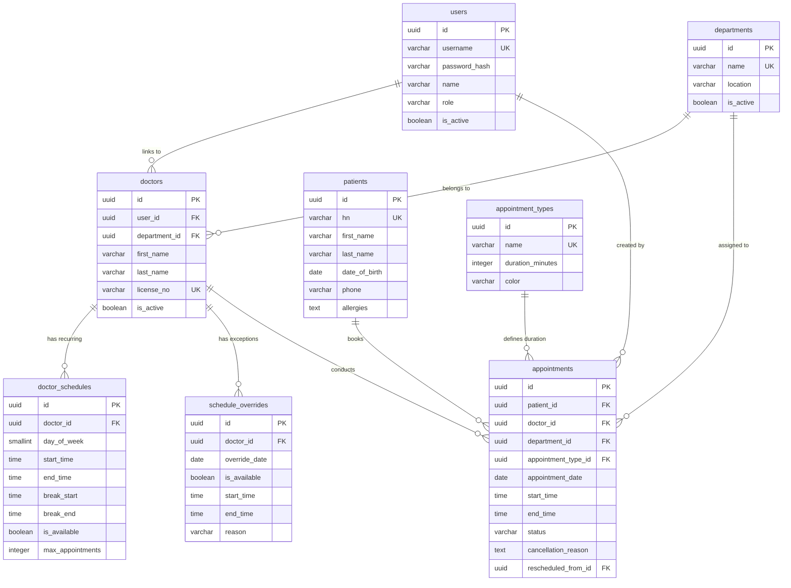

# 🏥 ระบบจัดการนัดหมายผู้ป่วยนอก (Hospital Outpatient Appointment Booking Module)

ระบบจัดการนัดหมายผู้ป่วยนอกแบบ Full-stack สำหรับเจ้าหน้าที่โรงพยาบาล (Receptionist/Admin) รองรับตารางเวลาแพทย์แบบรายสัปดาห์และตารางยกเว้นรายวัน (Overrides), การคำนวณ Slot ว่างอัตโนมัติตามระยะเวลาของแต่ละประเภทนัดหมาย, การป้องกันการจองซ้อนด้วย Pessimistic Locking และการจัดการวงจรสถานะการนัดหมาย (Status Lifecycle)

---
## 🚀 เริ่มต้นใช้งานด้วย Docker (แนะนำ)

สั่งรันทั้งระบบ (PostgreSQL + Backend API + Frontend) ด้วยคำสั่งเดียว:

```bash
# 1. Clone โปรเจกต์
git clone https://github.com/warutboom100/Appointment-Booking-Module.git
cd Appointment-Booking-Module

# 2. Build และ Start คอนเทนเนอร์
docker compose up --build
```

เมื่อทำงานเสร็จสมบูรณ์ สามารถเข้าใช้งานได้ที่:
- 🌐 **Frontend (Web App)**: [http://localhost:3000](http://localhost:3000)
- 🔌 **Backend (REST API)**: [http://localhost:4000/api/v1](http://localhost:4000/api/v1)
- 🗄 **PostgreSQL Database**: `localhost:5432` (`appointment_db`)

*(ระบบจะรัน Migration และ Seed ข้อมูลเริ่มต้นให้โดยอัตโนมัติ)*

---

## 💻 การติดตั้งแบบ Local Development

### ความต้องการของระบบ
- **Node.js**: v20 ขึ้นไป
- **PostgreSQL**: v16 ทำงานอยู่ที่ Local Port 5432

### 1. ฝั่ง Backend

```bash
cd backend

# ติดตั้ง Dependencies
npm install

# คัดลอกไฟล์ Environment
cp .env.example .env

# รัน Migration และ Seed ข้อมูล
npm run migrate
npm run seed

# รัน Backend เซิร์ฟเวอร์
npm run dev
```
*(Backend ทำงานที่ [http://localhost:4000](http://localhost:4000))*

### 2. ฝั่ง Frontend

```bash
cd ../frontend

# ติดตั้ง Dependencies
npm install

# คัดลอกไฟล์ Environment
cp .env.example .env

# รัน Next.js เซิร์ฟเวอร์
npm run dev
```
*(Frontend ทำงานที่ [http://localhost:3000](http://localhost:3000))*

---

## 👥 บัญชีผู้ใช้ทดสอบ (Demo Accounts) แนะนำตรวจด้วย admin

| Username | Password | Role | สิทธิ์การใช้งาน |
|---|---|---|---|
| `admin` | `password123` | `admin` | สิทธิ์สูงสุด จัดการ Master Data, หมอ, แผนก, ตารางตรวจ, ตั้งค่าระบบ |
| `receptionist1` | `password123` | `receptionist` | เจ้าหน้าที่เวชระเบียน (สมหญิง) ลงทะเบียนคนไข้, จอง/เลื่อน/ยกเลิกนัด, เช็คอิน |
| `receptionist2` | `password123` | `receptionist` | เจ้าหน้าที่เวชระเบียน (มานิต) |
| `dr_somchai` | `password123` | `doctor` | แพทย์ (อายุรกรรม) ดูตารางตรวจ คิวคนไข้ และอัปเดตสถานะตรวจเสร็จ |
| `dr_natthapong` | `password123` | `doctor` | แพทย์ (โรคหัวใจ) |
| `dr_wipawan` | `password123` | `doctor` | แพทย์ (ออร์โธปิดิกส์) |

---

## 📖 ภาพรวมโปรเจกต์

ระบบนี้พัฒนาขึ้นเพื่อแก้ปัญหาความซับซ้อนในการนัดหมายผู้ป่วยนอกของโรงพยาบาล โดยมีจุดเด่นสำคัญ:
1. **Dynamic Schedule Matching**: รวมตารางเวรปกติ (Weekly Schedule) กับตารางยกเว้น (Overrides เช่น วันลา/เวรพิเศษ) แบบ Real-time
2. **Duration-based Slot Slicing**: ซอยช่วงเวลาว่างตามความยาวของประเภทการรักษา (15, 20, 30, 45 นาที) พร้อมตัดช่วงพักเบรก (Break Time) อัตโนมัติ
3. **Pessimistic Concurrency Locking**: ป้องกันปัญหาการกดจองเวลาเดียวกันพร้อมกัน (Race Condition / Double Booking) ด้วย `SELECT ... FOR UPDATE` ระดับแถวใน Database Transaction
4. **Complete Status Lifecycle**: จัดการสถานะตั้งแต่จอง ยืนยัน เข้ารับการตรวจ ไปจนถึงตรวจเสร็จ หรือการยกเลิก/เลื่อนนัด

---

## ✨ ฟีเจอร์หลัก

| ระบบ | รายละเอียดการทำงาน |
|---|---|
| **ตารางเวลาแพทย์ (Schedules)** | จัดการตารางเวลาประจำสัปดาห์ (จันทร์-อาทิตย์), กำหนดเวลาเริ่ม-เลิก, เวลาพักเบรก, เปิด-ปิดรับนัด และกำหนดเพดานรับคนไข้รายวัน (`max_appointments`) |
| **ตารางยกเว้นรายวัน (Overrides)** | บันทึกวันหยุด ลาประชุมวิชาการ หรือเปิดคลินิกพิเศษนอกเวลา ซึ่งจะมีผลทับตารางประจำสัปดาห์โดยอัตโนมัติ |
| **ประเภทการนัดหมาย (Appointment Types)** | กำหนดประเภทการตรวจพร้อมระยะเวลาที่ใช้ (เช่น New Patient 30 นาที, Follow-up 15 นาที, Procedure 45 นาที) และแท็กสีสำหรับ UI |
| **ค้นหา Slot ว่าง (Slot Finder)** | คำนวณช่วงเวลาว่างของแพทย์ตามวันที่และประเภทนัดหมาย ไม่แสดงเวลาที่ถูกจองแล้ว ช่วงพักเบรก และเวลาที่เลยมาแล้ว |
| **ระบบจองที่ปลอดภัย (Booking Engine)** | ตรวจสอบเงื่อนไขอย่างเข้มงวด 11 ขั้นตอน ป้องกันการจองย้อนหลัง จองนอกเวลา หรือจองชนคิว |
| **วงจรสถานะ (Lifecycle Management)** | อัปเดตสถานะ: `Booked` ➔ `Confirmed` ➔ `Checked-in` ➔ `In Progress` ➔ `Completed` (รวมถึง `Cancelled`, `No-show`, `Rescheduled`) |
| **ยกเลิกและเลื่อนนัด (Cancel & Reschedule)** | บันทึกเหตุผลการยกเลิกและคืน Slot ทันที พร้อมระบบ Reschedule แบบ Atomic Transaction เชื่อมโยงประวัตินัดเดิม |
| **ทะเบียนผู้ป่วย (Patient Directory)** | บันทึกข้อมูลคนไข้ สร้างรหัส HN อัตโนมัติ (`HN-XXXXXX`), ข้อมูลแพ้ยา และดูประวัติการนัดหมายย้อนหลัง |
| **Dashboard สรุปภาพรวม** | สรุปสถิติประจำวัน, จำนวนแพทย์ที่เข้าตรวจ, จำนวนคิวแยกตามสถานะ และตารางคิวแบบ Real-time |
| **ระบบสิทธิ์ (RBAC & Auth)** | แบ่งสิทธิ์การใช้งาน (`Admin`, `Receptionist`, `Doctor`) ด้วย JWT และ Refresh Token Rotation ผ่าน HTTP-Only Cookies |

---

## 🧠 Business Logic & การออกแบบระบบ

### 1. ประเภทการนัดหมายและข้อสมมติฐานเรื่องระยะเวลา (Appointment Types & Duration)

ระบบรองรับการกำหนดประเภทการนัดหมายที่แตกต่างกันตามลักษณะทางคลินิก โดยมีค่าเริ่มต้นและข้อสมมติฐาน (Assumptions) ดังนี้:

| ประเภทการนัดหมาย | ระยะเวลา | สีประจำประเภท | พฤติกรรมและเหตุผลทางการแพทย์ (Behavior & Clinical Assumptions) |
|---|---|---|---|
| **New Patient Visit**<br>*(ผู้ป่วยใหม่)* | **30 นาที** | `#4CAF50` (เขียว) | **ผู้ป่วยที่มารับการตรวจครั้งแรก**: ต้องใช้เวลาในการซักประวัติสุขภาพอย่างละเอียด ตรวจร่างกายเบื้องต้น บันทึกประวัติการแพ้ยา และตั้งข้อสมมติฐานการวินิจฉัยโรค จึงต้องการเวลามากกว่าปกติ |
| **Follow-up Visit**<br>*(ตรวจติดตามอาการ)* | **15 นาที** | `#2196F3` (ฟ้า) | **ผู้ป่วยเดิมที่แพทย์นัดติดตามผล**: ตรวจประเมินอาการเดิมหลังจากรับการรักษา ดูผลตรวจทางห้องปฏิบัติการหรือเอกซเรย์ และสั่งจ่ายยาต่อเนื่อง เป็นการตรวจระยะสั้นที่เน้นความรวดเร็ว |
| **Consultation**<br>*(ขอคำปรึกษาเฉพาะทาง)* | **20 นาที** | `#FF9800` (ส้ม) | **การขอคำปรึกษาเชิงลึกหรือ Second Opinion**: ผู้ป่วยที่ต้องการปรึกษาแนวทางการรักษาเฉพาะด้าน หรือแพทย์ส่งตัวเพื่อประเมินความเห็นเพิ่มเติม จึงกำหนดเวลาไว้ปานกลาง |
| **Procedure**<br>*(ทำหัตถการผู้ป่วยนอก)* | **45 นาที** | `#F44336` (แดง) | **หัตถการขนาดเล็กที่ไม่ต้องนอนโรงพยาบาล**: เช่น การเย็บ/ตัดไหม, ล้างและทำแผลผ่าตัด, การฉีดยาเฉพาะจุด หรือการตรวจชิ้นเนื้อ ซึ่งต้องมีเวลาเตรียมอุปกรณ์และดูแลผู้ป่วยหลังทำหัตถการ |

#### ข้อสมมติฐานในการออกแบบ (Design Assumptions):
1. **Duration Stepping**: การคำนวณช่วงเวลาว่าง (Slot) จะแบ่งตามระยะเวลาของประเภทนัดหมายนั้นๆ (เช่น ประเภท 30 นาที ในช่วง 09:00–12:00 จะสร้าง Slot ที่ `09:00–09:30`, `09:30–10:00`, `10:00–10:30` ...) เพื่อป้องกันการเกิดเศษเวลาเหลื่อมกันที่ไม่ลงตัว (No Fragmented Time Gaps)
2. **Dynamic Configuration**: ระยะเวลาและชื่อประเภทการนัดหมายไม่ได้ Hardcode อยู่ในระบบ แต่เก็บเป็น Master Data ในตาราง `appointment_types` ทำให้ผู้ดูแลระบบ (Admin) สามารถปรับเปลี่ยนเวลาหรือเพิ่มประเภทใหม่ได้ผ่าน CRUD API ตามนโยบายของแต่ละแผนกในอนาคต

---

### 2. ขั้นตอนการตรวจสอบการจอง (11-Step Validation)

ทุกคำขอการจองต้องผ่านการตรวจสอบตามลำดับดังนี้:

| ลำดับ | กฎการตรวจสอบ | รหัสข้อผิดพลาด | HTTP Status |
|---|---|---|---|
| **1** | วันที่นัดหมายต้องไม่เป็นอดีต | `PAST_DATE` | `400 Bad Request` |
| **2** | ต้องจองล่วงหน้าอย่างน้อย 1 ชั่วโมง (`MIN_ADVANCE_HOURS = 1`) | `TOO_LATE` | `400 Bad Request` |
| **3** | แพทย์ต้องมีตารางตรวจในวันที่เลือก | `NO_SCHEDULE` | `400 Bad Request` |
| **4** | สถานะตารางแพทย์ต้องเปิดให้จอง (`is_available = true`) | `SCHEDULE_UNAVAILABLE` | `400 Bad Request` |
| **5** | เวลาที่จองต้องอยู่ในช่วงเวลาทำงานของแพทย์ | `OUTSIDE_WORKING_HOURS` | `400 Bad Request` |
| **6** | เวลาที่จองต้องไม่ตรงกับเวลาพักเบรกของแพทย์ | `DURING_BREAK` | `400 Bad Request` |
| **7** | เวลาที่จองต้องไม่ชนกับนัดหมายอื่นของแพทย์ที่ยัง Active | `SLOT_TAKEN` | `409 Conflict` |
| **8** | ข้อมูลแพทย์ต้องเปิดใช้งานอยู่ในระบบ (`is_active = true`) | `DOCTOR_INACTIVE` | `400 Bad Request` |
| **9** | ข้อมูลผู้ป่วยต้องเปิดใช้งานอยู่ในระบบ (`is_active = true`) | `PATIENT_INACTIVE` | `400 Bad Request` |
| **10** | ประเภทการนัดหมายต้องเปิดใช้งานอยู่ (`is_active = true`) | `TYPE_INACTIVE` | `400 Bad Request` |
| **11** | จำนวนนัดหมายในวันนั้นต้องไม่เกินโควตาสูงสุด (`max_appointments`) | `MAX_APPOINTMENTS_REACHED` | `409 Conflict` |

---

### 3. การป้องกัน Race Condition (Concurrency Control)

ใช้เทคนิค **Pessimistic Row-Level Locking (`SELECT ... FOR UPDATE`)** ภายใน Database Transaction:

```typescript
await knex.transaction(async (trx) => {
  // 1. ล็อกแถวข้อมูลแพทย์เพื่อจัดลำดับการประมวลผลคำขอที่เข้ามาพร้อมกัน
  const doctor = await trx('doctors')
    .where({ id: doctorId })
    .forUpdate()
    .first();

  // 2. ตรวจสอบว่ามีนัดหมายอื่นทับซ้อนเวลาหรือไม่
  const conflicting = await trx('appointments')
    .where({ doctor_id: doctorId, appointment_date: date })
    .whereNotIn('status', ['cancelled', 'rescheduled'])
    .where('start_time', '<', endTime)
    .where('end_time', '>', startTime)
    .first();

  if (conflicting) {
    throw new AppError('This appointment slot is already booked', 409, 'SLOT_TAKEN');
  }

  // 3. บันทึกข้อมูลการนัดหมาย
  const [appointment] = await trx('appointments').insert(payload).returning('*');
  return appointment;
});
```

---

### 4. สถานะนัดหมายและผลกระทบต่อ Slot ว่าง (Status Lifecycle & Availability Impact)

```
                    ┌──────────────┐
              ┌────▶│  cancelled   │ (คืน Slot ให้ผู้อื่นจองได้ทันที)
              │     └──────────────┘
              │
┌────────┐    │     ┌──────────────┐     ┌──────────────┐     ┌──────────────┐     ┌──────────────┐
│ booked │────┼────▶│  confirmed   │────▶│  checked_in  │────▶│ in_progress  │────▶│  completed   │
└────────┘    │     └──────┬───────┘     └──────┬───────┘     └──────────────┘     └──────────────┘
              │            │                    │
              │            │                    ▼
              │            │             ┌──────────────┐
              │            └────────────▶│   no_show    │ (ยังคงล็อก Slot ไว้)
              │                          └──────────────┘
              │
              │     ┌──────────────┐
              └────▶│ rescheduled  │ (คืน Slot เดิม และสร้างรายการนัดหมายใหม่)
                    └──────────────┘
```

#### รายละเอียดผลกระทบของแต่ละสถานะต่อความพร้อมใช้งานของ Slot:

| สถานะ (Status) | ล็อก Slot หรือไม่? (Blocks Slot?) | คำอธิบายและเหตุผล (Reason & Business Behavior) |
|---|:---:|---|
| `booked` | 🔒 **ล็อก (Yes)** | รายการนัดหมายถูกสร้างขึ้นแล้ว และกำลังรอการยืนยันจากคนไข้หรือเจ้าหน้าที่ |
| `confirmed` | 🔒 **ล็อก (Yes)** | ผู้ป่วยยืนยันการเดินทางมาตามนัดหมายแล้ว |
| `checked_in` | 🔒 **ล็อก (Yes)** | ผู้ป่วยเดินทางมาถึงโรงพยาบาลและทำการเช็คอิน ณ จุดรับบัตรคิวแล้ว |
| `in_progress` | 🔒 **ล็อก (Yes)** | ผู้ป่วยกำลังเข้าตรวจกับแพทย์ในห้องตรวจ |
| `completed` | 🔒 **ล็อก (Yes)** | การตรวจเสร็จสิ้นแล้ว — **ยังคงล็อก Slot** เนื่องจากช่วงเวลาดังกล่าวได้ถูกใช้งานไปจริงในอดีตแล้ว ไม่สามารถให้ผู้ป่วยคนอื่นมาจองทับย้อนหลังได้ |
| `no_show` | 🔒 **ล็อก (Yes)** | ผู้ป่วยไม่มาตามนัดหลังจากเวลาผ่านพ้นไป — **ยังคงล็อก Slot** เพื่อเก็บเป็นประวัติการใช้เวลาตรวจของแพทย์ และป้องกันการจองทับย้อนหลัง |
| `cancelled` | 🔓 **ปลดล็อก (No)** | นัดหมายถูกยกเลิก — **Slot ว่างจะถูกคืนให้ระบบทันที** เพื่อเปิดโอกาสให้คนไข้รายอื่นสามารถเลือกจองช่วงเวลานี้ได้ (หากยังไม่เลยเวลาในวันปัจจุบัน) |
| `rescheduled` | 🔓 **ปลดล็อก (No)** | นัดหมายถูกเลื่อนไปเวลาใหม่ — **Slot เดิมจะถูกคืนทันที** และระบบจะไปสร้างการจองใหม่ใน Slot ปลายทางแทน |

> **กลไกการกรองใน SQL Query**:
> เมื่อระบบคำนวณ Slot ว่าง จะใช้คำสั่ง:
> ```sql
> WHERE status NOT IN ('cancelled', 'rescheduled')
> ```
> ทำให้นัดหมายที่ยกเลิกหรือเลื่อนแล้ว จะไม่ถูกนำมาเป็นเงื่อนไขในการบล็อกเวลาว่าง

---

### 5. นโยบายยกเลิกและเลื่อนนัด (Cancel & Reschedule)

- **การยกเลิกนัด (Cancel)**: ทำได้เฉพาะนัดหมายสถานะ `booked` หรือ `confirmed`, บังคับระบุเหตุผล (`cancellation_reason`), บันทึกผู้กดยกเลิกและเวลา, และคืน Slot ว่างให้ผู้อื่นทันที
- **การเลื่อนนัด (Reschedule)**: ทำงานแบบ Atomic Transaction — ปรับนัดเดิมเป็น `rescheduled` และสร้างนัดใหม่โดยใส่ `rescheduled_from_id` เชื่อมโยงรายการเดิม พร้อมเข้าสู่กระบวนการตรวจเงื่อนไข 11 ขั้นตอนใหม่อีกครั้ง

---

## 🛠 Tech Stack

- **Backend**: Node.js (LTS), Express 5.x, TypeScript, PostgreSQL 16 (Timezone: `Asia/Bangkok`), Knex.js (Query Builder & Migrations), Zod (Validation), JWT + Refresh Token (HTTP-Only Cookies), Bcryptjs, Helmet, CORS
- **Frontend**: Next.js 16 (App Router), React 19, TypeScript, Tailwind CSS v4, TanStack Query v5 (React Query), Zustand, Axios, Lucide React
- **Testing**: Vitest, Supertest, Testing Library, JSDOM
- **DevOps**: Docker, Docker Compose (Multi-stage builds)

---

## 📁 โครงสร้างโปรเจกต์ (Project Structure)

โปรเจกต์จัดโครงสร้างแบบ Monorepo แบ่งออกเป็น `backend` (Express REST API) และ `frontend` (Next.js App Router):

```
Appointment-Booking-Module/
├── docker-compose.yml                      # Orchestration รัน 3 Services (db, backend, frontend)
├── .env.docker                             # ค่า Environment Variables สำหรับรัน Docker Compose
│
├── backend/                                # ── Backend Service (Express 5 + TypeScript) ──
│   ├── Dockerfile                          # Multi-stage Docker build สำหรับ Node.js
│   ├── package.json & tsconfig.json        # Dependencies & TypeScript configuration
│   ├── migrations/                         # Knex Database Migrations (8 ตารางตามลำดับ)
│   │   ├── 001_create_users.ts             # ตาราง users + refresh_tokens
│   │   ├── 002_create_departments.ts       # ตาราง departments
│   │   ├── 003_create_doctors.ts           # ตาราง doctors (Foreign Key ไปยัง departments, users)
│   │   ├── 004_create_patients.ts          # ตาราง patients + patient_hn_seq
│   │   ├── 005_create_appointment_types.ts # ตาราง appointment_types (duration, color)
│   │   ├── 006_create_doctor_schedules.ts  # ตาราง doctor_schedules (ตารางประจำสัปดาห์ 0-6)
│   │   ├── 007_create_schedule_overrides.ts# ตาราง schedule_overrides (ตารางยกเว้น/วันลา)
│   │   └── 008_create_appointments.ts      # ตาราง appointments + statuses + cancellation
│   ├── seeds/
│   │   └── 001_initial_seed.ts             # Seed ข้อมูลจำลองสำหรับทดสอบ (Users, Doctors, Slots)
│   ├── test/                               # ชุดทดสอบ Vitest Integration Tests (9 Suites, 131 Tests)
│   │   ├── setup.ts & helpers.ts           # Test Setup & Truncate Tables Isolation Helper
│   │   ├── auth.test.ts                    # ทดสอบ Login, Token Rotation, Logout, RBAC
│   │   ├── appointments.test.ts            # ทดสอบ 11 Validation, Pessimistic Lock, Reschedule
│   │   ├── schedules.test.ts               # ทดสอบตารางสัปดาห์และการตรวจ Overlap
│   │   ├── overrides.test.ts               # ทดสอบตารางยกเว้น วันลา และ Priority เหนือตารางปกติ
│   │   ├── patients.test.ts                # ทดสอบสร้างเลข HN อัตโนมัติและประวัตินัดหมาย
│   │   ├── doctors.test.ts                 # ทดสอบ CRUD แพทย์และ Unique License
│   │   ├── departments.test.ts             # ทดสอบ CRUD แผนก
│   │   ├── appointment-types.test.ts       # ทดสอบ CRUD ประเภทนัดหมาย
│   │   └── dashboard.test.ts               # ทดสอบสรุปสถิติประจำวันและคิวตรวจ
│   └── src/
│       ├── app.ts                          # Express Bootstrap (Helmet, CORS, Rate Limit, Routes)
│       ├── config/
│       │   ├── env.ts                      # Parse & Validate Environment Variables ด้วย Zod
│       │   └── response.ts                 # Standard JSON Response Envelope (`sendSuccess`, `sendPaginated`)
│       ├── knex/
│       │   ├── db.ts                       # Knex Database Instance Connection Pool
│       │   ├── migrate.ts                  # Migration Runner CLI Script
│       │   └── seed.ts                     # Seed Runner CLI Script
│       ├── middleware/
│       │   ├── authenticate.ts             # JWT Bearer & ApiKey Verification (Dev Mode)
│       │   ├── authorize.ts                # Role-Based Access Control (Admin, Receptionist, Doctor)
│       │   ├── error-handler.ts            # Centralized Error Handler (Zod, AppError, PostgreSQL)
│       │   ├── not-found.ts                # 404 Not Found Middleware
│       │   └── request-logger.ts           # HTTP Request Logger
│       ├── types/
│       │   └── express.d.ts                # Express Request Type Extensions (User Payload)
│       ├── utils/
│       │   └── time.ts                     # Time calculation & Asia/Bangkok UTC+7 utilities
│       └── api/                            # Domain Modules (4-File Module Pattern)
│           ├── auth/                       # [Router, Controller, Service, Schema]
│           ├── departments/                # [Router, Controller, Service, Schema]
│           ├── doctors/                    # [Router, Controller, Service, Schema]
│           ├── patients/                   # [Router, Controller, Service, Schema, Patient.fn]
│           ├── appointment-types/          # [Router, Controller, Service, Schema]
│           ├── schedules/                  # [Router, Controller, Service, Schema, Schedule.fn]
│           ├── overrides/                  # [Router, Controller, Service, Schema]
│           ├── appointments/               # [Router, Controller, Service, Schema, Appointment.fn]
│           └── dashboard/                  # [Router, Controller, Service, Schema]
│
└── frontend/                               # ── Frontend Web App (Next.js 16 + React 19) ──
    ├── Dockerfile                          # Multi-stage Docker build สำหรับ Next.js
    ├── package.json & tsconfig.json        # Dependencies & TypeScript Configuration
    ├── app/                                # Next.js App Router Structure
    │   ├── layout.tsx & globals.css        # Root Layout & Tailwind CSS v4 Clinical Tokens
    │   ├── favicon.ico                     # Clinical Favicon Icon
    │   ├── (auth)/
    │   │   └── login/page.tsx              # หน้าเข้าสู่ระบบของเจ้าหน้าที่
    │   └── (dashboard)/                    # ส่วน Dashboard หลังเข้าสู่ระบบ (Sidebar Layout)
    │       ├── layout.tsx                  # Dashboard Frame Layout (Sidebar + Navbar)
    │       ├── page.tsx                    # Clinic Overview & Live Real-time Queue Table
    │       ├── appointments/page.tsx       # รายการนัดหมาย, ค้นหา, กรอง และปุ่มเปิดจองนัด
    │       ├── schedules/page.tsx          # ตารางตรวจแพทย์ประจำสัปดาห์และปฏิทินบันทึกวันลา
    │       ├── patients/page.tsx           # ทะเบียนคนไข้, ค้นหาด่วน และ Timeline ประวัติย้อนหลัง
    │       ├── doctors/page.tsx            # ทำเนียบแพทย์ประจำโรงพยาบาลและสังกัดแผนก
    │       ├── departments/page.tsx        # รายชื่อแผนกการรักษา
    │       └── appointment-types/page.tsx  # ตั้งค่าประเภทนัดหมาย ระยะเวลาตรวจ และสีแท็ก
    └── src/
        ├── api/                            # Axios API Client & Module Request Wrappers
        │   ├── client.ts                   # Axios Client Instance พร้อม Response Interceptors
        │   ├── auth.api.ts                 # ฟังก์ชันเรียก Auth (Login, Refresh, Logout, Me)
        │   ├── appointment.api.ts          # ฟังก์ชันเรียก Appointments & Available Slots
        │   ├── schedule.api.ts             # ฟังก์ชันเรียก Schedules & Overrides
        │   ├── patient.api.ts              # ฟังก์ชันเรียก Patients & Appointments History
        │   ├── doctor.api.ts               # ฟังก์ชันเรียก Doctors CRUD
        │   ├── department.api.ts           # ฟังก์ชันเรียก Departments CRUD
        │   ├── appointment-type.api.ts     # ฟังก์ชันเรียก Appointment Types CRUD
        │   ├── dashboard.api.ts            # ฟังก์ชันเรียก Summary & Stats
        │   └── index.ts                    # Central API Exports
        ├── components/                     # Component Library แยกหมวดหมู่ตามหน้าที่
        │   ├── ui/                         # Base Components (Button, Input, Select, Textarea, TimeInput, Modal, Card, Badge, StatusBadge, Table, SegmentedControl)
        │   ├── appointments/               # BookingModal, StepPatientSelect, StepDoctorSelect, StepSlotPicker, StepSummaryConfirm, CancelAppointmentModal, RescheduleAppointmentModal
        │   ├── schedules/                  # WeeklyTimetableGrid, ScheduleModal, OverrideModal, OverridesListTable, MonthlyCalendarView, DayScheduleDrawer
        │   ├── patients/                   # PatientQuickAddModal, PatientHistoryTimeline
        │   ├── doctors/                    # DoctorModal
        │   ├── departments/                # DepartmentModal
        │   ├── appointment-types/          # AppointmentTypeModal
        │   ├── layout/                     # Sidebar, Navbar
        │   ├── feedback/                   # ConfirmDialog, EmptyState, LoadingSpinner
        │   ├── auth/                       # AuthGuard
        │   ├── Pagination.tsx              # Component Pagination
        │   ├── SearchBar.tsx               # Component กล่องค้นหา
        │   ├── ThemeToggle.tsx             # Component สลับ Dark/Light Mode
        │   └── Logo.tsx                    # Logo ประจำระบบ
        ├── hooks/                          # TanStack React Query Custom Hooks
        │   ├── useAppointments.ts          # Hooks ดึงนัดหมาย, Slot ว่าง, จอง, ยกเลิก, เลื่อนนัด
        │   ├── useSchedules.ts             # Hooks จัดการตารางแพทย์ และ Overrides
        │   ├── usePatients.ts              # Hooks จัดการข้อมูลผู้ป่วย และประวัตินัด
        │   ├── useDoctors.ts               # Hooks จัดการข้อมูลแพทย์
        │   ├── useDepartments.ts           # Hooks จัดการแผนก
        │   ├── useAppointmentTypes.ts      # Hooks จัดการประเภทนัดหมาย
        │   ├── useDashboard.ts             # Hooks ดึงข้อมูล Summary & Stats
        │   └── useDebounce.ts              # Hook หน่วงเวลาการ Search
        ├── lib/                            # Utility Functions & Local Storage Helper
        │   ├── format.ts                   # Date & Time Formatting (พ.ศ./ค.ศ., Badge Colors)
        │   └── storage.ts                  # Local Storage User Token Manager
        ├── providers/                      # Application Context Providers
        │   ├── QueryProvider.tsx           # TanStack QueryClientProvider & Cache Config
        │   └── ToastProvider.tsx           # Toast Notification Context
        ├── stores/                         # Global State Management
        │   └── auth.store.ts               # Zustand Store จัดการ Auth State & Profile
        └── types/                          # TypeScript Interfaces & Types
            └── index.ts                    # Type Definitions ครอบคลุมทุก Entity และ API Models
```

### 🧩 รูปแบบสถาปัตยกรรม Backend (4-File Module Pattern)
ในแต่ละโฟลเดอร์ย่อยของ `backend/src/api/*` จะแบ่งหน้าที่ชัดเจนตามหลัก Separation of Concerns:
1. **`*.router.ts`**: ประกาศ HTTP Routes, กำหนดสิทธิ์ผู้ใช้ (`authorize`), และเรียก Controller
2. **`*.controller.ts`**: รับ Request, เรียกใช้ Validation, ส่งต่องานให้ Service และจัด Format Response
3. **`*.service.ts`**: จัดการ Business Logic, เรียกใช้ Database Transaction และ Pessimistic Locking
4. **`*.schema.ts`**: กำหนด Zod Schema สำหรับตรวจสอบ Request Body, Params และ Query String อย่างเข้มงวด

---

## 🔌 REST API Endpoints & สิทธิ์การใช้งาน

**Base URL**: `http://localhost:4000/api/v1`  
*การยืนยันตัวตน: แนบ Header `Authorization: Bearer <token>` หรือ Cookie `refreshToken` (ในโหมด Dev/Test รองรับ `Authorization: ApiKey testapi` พร้อม `X-Role: admin`)*

### 1. ระบบยืนยันตัวตน (Authentication — `/auth`)
| Method | Endpoint | คำอธิบาย | สิทธิ์การใช้งาน |
|---|---|---|---|
| `POST` | `/auth/login` | เข้าสู่ระบบด้วย username & password (รับ Access Token และ Refresh Token Cookie) | Public |
| `POST` | `/auth/register` | ลงทะเบียนผู้ใช้งานใหม่ | Public / Admin |
| `POST` | `/auth/refresh` | ขอ Access Token ใหม่ด้วย Refresh Token จาก HTTP-Only Cookie | Public |
| `POST` | `/auth/logout` | ออกจากระบบและยกเลิก Refresh Token | Authenticated |
| `GET` | `/auth/me` | ดูข้อมูลโปรไฟล์ของผู้ใช้งานปัจจุบัน | ทุกบทบาท (Authenticated) |

### 2. ระบบนัดหมายผู้ป่วยนอก (Appointments — `/appointments`)
| Method | Endpoint | คำอธิบาย | สิทธิ์การใช้งาน |
|---|---|---|---|
| `GET` | `/appointments/available-slots` | คำนวณ Slot ว่างตาม `doctor_id`, `date`, `appointment_type_id` | ทุกบทบาท (Authenticated) |
| `GET` | `/appointments` | ค้นหารายการนัดหมาย (Filter: date, from_date, to_date, doctor_id, patient_id, status, search) | ทุกบทบาท (Authenticated) |
| `GET` | `/appointments/:id` | ดูรายละเอียดนัดหมายพร้อมข้อมูลแพทย์ แผนก ผู้ป่วย และประเภทนัดหมาย | ทุกบทบาท (Authenticated) |
| `POST` | `/appointments` | จองนัดหมายใหม่ (ตรวจสอบ 11 ขั้นตอน + Pessimistic Row Lock) | `Admin`, `Receptionist` |
| `PATCH` | `/appointments/:id/status` | เปลี่ยนสถานะนัดหมาย (`confirmed`, `checked_in`, `in_progress`, `completed`, `no_show`) | `Admin`, `Receptionist`, `Doctor` |
| `PATCH` | `/appointments/:id/cancel` | ยกเลิกนัดหมาย (บังคับระบุเหตุผล คืน Slot ทันที) | `Admin`, `Receptionist` |
| `POST` | `/appointments/:id/reschedule` | เลื่อนนัดหมาย (Atomic Cancel นัดเดิม + สร้างนัดใหม่) | `Admin`, `Receptionist` |

### 3. ตารางเวลาแพทย์ประจำสัปดาห์ (Doctor Schedules — `/schedules` & `/doctors/:doctorId/schedules`)
| Method | Endpoint | คำอธิบาย | สิทธิ์การใช้งาน |
|---|---|---|---|
| `GET` | `/schedules` | ดึงรายการตารางเวลาแพทย์ทั้งหมด (Pagination & Search) | ทุกบทบาท (Authenticated) |
| `GET` | `/schedules/:id` | ดูรายละเอียดตารางเวลาแพทย์ตาม ID | ทุกบทบาท (Authenticated) |
| `PATCH` | `/schedules/:id` | แก้ไขตารางเวลาแพทย์ (ตรวจสอบการซ้อนทับอัตโนมัติ) | `Admin` |
| `DELETE` | `/schedules/:id` | ลบตารางเวลาแพทย์ | `Admin` |
| `GET` | `/doctors/:doctorId/schedules` | ดึงตารางเวลาประจำสัปดาห์ของแพทย์คนนั้นๆ (0=อาทิตย์ ถึง 6=เสาร์) | ทุกบทบาท (Authenticated) |
| `POST` | `/doctors/:doctorId/schedules` | เพิ่มช่วงเวลาตรวจให้แพทย์ (ตรวจสอบการซ้อนทับอัตโนมัติ) | `Admin` |

### 4. ตารางยกเว้นและวันลาแพทย์ (Schedule Overrides — `/overrides` & `/doctors/:doctorId/overrides`)
| Method | Endpoint | คำอธิบาย | สิทธิ์การใช้งาน |
|---|---|---|---|
| `GET` | `/overrides` | ดึงรายการ Override ทั้งหมด (Filter: doctor_id, from_date, to_date) | ทุกบทบาท (Authenticated) |
| `GET` | `/overrides/:id` | ดูรายละเอียด Override ตาม ID | ทุกบทบาท (Authenticated) |
| `PATCH` | `/overrides/:id` | แก้ไขข้อมูล Override | `Admin` |
| `DELETE` | `/overrides/:id` | ลบ Override (ระบบจะกลับไปใช้ตารางประจำสัปดาห์) | `Admin` |
| `GET` | `/doctors/:doctorId/overrides` | ดึงรายการ Override เฉพาะของแพทย์คนนั้นๆ | ทุกบทบาท (Authenticated) |
| `POST` | `/doctors/:doctorId/overrides` | สร้าง Override (กำหนดวันลาแพทย์ หรือเวลาตรวจพิเศษ) | `Admin` |

### 5. ทะเบียนผู้ป่วย (Patients — `/patients`)
| Method | Endpoint | คำอธิบาย | สิทธิ์การใช้งาน |
|---|---|---|---|
| `GET` | `/patients` | ค้นหารายชื่อผู้ป่วย (ค้นด้วยชื่อ, นามสกุล, HN, เบอร์โทร, เลขบัตรประชาชน) | ทุกบทบาท (Authenticated) |
| `GET` | `/patients/:id` | ดูข้อมูลผู้ป่วยตาม ID | ทุกบทบาท (Authenticated) |
| `GET` | `/patients/:id/appointments` | ดึงประวัติการนัดหมายทั้งหมดของผู้ป่วยรายนั้น | ทุกบทบาท (Authenticated) |
| `POST` | `/patients` | ลงทะเบียนผู้ป่วยใหม่ (สร้างรหัส `HN-XXXXXX` อัตโนมัติ) | `Admin`, `Receptionist` |
| `PATCH` | `/patients/:id` | แก้ไขข้อมูลประวัติผู้ป่วย | `Admin`, `Receptionist` |
| `DELETE` | `/patients/:id` | ปิดการใช้งานข้อมูลผู้ป่วย (Soft Delete) | `Admin` |

### 6. ข้อมูลแพทย์ (Doctors — `/doctors`)
| Method | Endpoint | คำอธิบาย | สิทธิ์การใช้งาน |
|---|---|---|---|
| `GET` | `/doctors` | ดึงรายชื่อแพทย์ทั้งหมด (Filter ตามแผนกและค้นหา) | ทุกบทบาท (Authenticated) |
| `GET` | `/doctors/:id` | ดูข้อมูลแพทย์พร้อมข้อมูลแผนกที่สังกัด | ทุกบทบาท (Authenticated) |
| `POST` | `/doctors` | เพิ่มข้อมูลแพทย์ใหม่ (ตรวจสอบเลขที่ใบอนุญาต unique) | `Admin` |
| `PATCH` | `/doctors/:id` | แก้ไขข้อมูลแพทย์ | `Admin` |
| `DELETE` | `/doctors/:id` | ปิดการใช้งานข้อมูลแพทย์ (Soft Delete) | `Admin` |

### 7. แผนกการรักษา (Departments — `/departments`)
| Method | Endpoint | คำอธิบาย | สิทธิ์การใช้งาน |
|---|---|---|---|
| `GET` | `/departments` | ดึงรายชื่อแผนกการรักษาทั้งหมด | ทุกบทบาท (Authenticated) |
| `GET` | `/departments/:id` | ดูข้อมูลแผนกการรักษาตาม ID | ทุกบทบาท (Authenticated) |
| `POST` | `/departments` | เพิ่มแผนกการรักษาใหม่ | `Admin` |
| `PATCH` | `/departments/:id` | แก้ไขข้อมูลแผนกการรักษา | `Admin` |
| `DELETE` | `/departments/:id` | ปิดการใช้งานแผนก (Soft Delete) | `Admin` |

### 8. ประเภทการนัดหมาย (Appointment Types — `/appointment-types`)
| Method | Endpoint | คำอธิบาย | สิทธิ์การใช้งาน |
|---|---|---|---|
| `GET` | `/appointment-types` | ดึงรายการประเภทการนัดหมายและระยะเวลาตรวจทั้งหมด | ทุกบทบาท (Authenticated) |
| `GET` | `/appointment-types/:id` | ดูข้อมูลประเภทการนัดหมายตาม ID | ทุกบทบาท (Authenticated) |
| `POST` | `/appointment-types` | เพิ่มประเภทการนัดหมายใหม่ (กำหนดระยะเวลาตรวจและสีแท็ก) | `Admin` |
| `PATCH` | `/appointment-types/:id` | แก้ไขประเภทการนัดหมาย | `Admin` |
| `DELETE` | `/appointment-types/:id` | ปิดการใช้งานประเภทการนัดหมาย (Soft Delete) | `Admin` |

### 9. รายงานสถิติและคิวตรวจ (Dashboard — `/dashboard`)
| Method | Endpoint | คำอธิบาย | สิทธิ์การใช้งาน |
|---|---|---|---|
| `GET` | `/dashboard/summary` | สรุปสถิติประจำวัน, จำนวนแพทย์เข้าตรวจ, แยกสถานะคิว, และตารางคิววันนี้ | ทุกบทบาท (Authenticated) |
| `GET` | `/dashboard/stats` | สรุปสถิติการนัดหมายตามช่วงวันที่ (`from_date`, `to_date`) | ทุกบทบาท (Authenticated) |

### 10. ตรวจสอบสถานะระบบ (Health Check)
| Method | Endpoint | คำอธิบาย | สิทธิ์การใช้งาน |
|---|---|---|---|
| `GET` | `/health` | ตรวจสอบสถานะความพร้อมของเซิร์ฟเวอร์ Backend API | Public |

---

## 🗄 Database Schema & Storage Architecture

### Entity Relationship Diagram (ERD)



### เหตุผลในการเลือกใช้ Relational Database (PostgreSQL) และ Knex.js

ในการพัฒนาระบบนัดหมายโรงพยาบาล (Hospital Information System) การเลือกใช้ **PostgreSQL (Relational Database)** ร่วมกับ **Knex.js** มีเหตุผลทางเทคนิคและสถาปัตยกรรมที่สำคัญดังนี้:

1. **การรับประกันความถูกต้องตามหลัก ACID และการล็อกแถวข้อมูล (Pessimistic Row Locking)**:
2. **การสร้างรหัส Hospital Number (HN) ต่อเนื่องด้วย PostgreSQL Sequence**:
3. **ความสัมพันธ์ของข้อมูลที่ซับซ้อนและการรักษา Referential Integrity**:
4. **การควบคุมความถูกต้องของข้อมูลเวลาด้วย Data Types และ CHECK Constraints**:
5. **เหตุผลที่เลือกใช้ Knex.js แทน ORM ขนาดใหญ่**:
   - **Full SQL Control**: สามารถเขียนคำสั่งล็อกแถว `forUpdate()`, จัดการ Transaction `trx`, และ JOIN ข้อมูลหลายตารางได้อย่างแม่นยำ
   - **Type Safety & Lightweight**: ทำงานร่วมกับ TypeScript ได้สะอาด ไม่มี Performance Overhead หรือ N+1 Query ที่ควบคุมยากเหมือน Full ORM
   - **Deterministic Test Environment**: จัดการ Database Migration และ Seed Data ได้สะดวกรวดเร็ว รองรับการทำ `TRUNCATE TABLE ... CASCADE` ระหว่างรัน Automated Integration Tests
---

## 🧪 การทดสอบระบบ (Testing)

โปรเจกต์มีชุดทดสอบ Integration Tests ครอบคลุมทุก Business Logic สำคัญ:

```bash
# รันชุดทดสอบ Backend ทั้งหมด (9 Suites, 131 Tests)
cd backend
npm test

# รันพร้อมเปิด Vitest UI Dashboard
npm run test:ui
```

### ผลการทดสอบ (131 / 131 Passed — 100%)
- **`appointments.test.ts` (26 tests)**: ตรวจสอบความถูกต้องของ Validation ทั้ง 11 ข้อ, การคำนวณ Slot ว่าง, การทดสอบ Concurrency Lock ด้วย `FOR UPDATE`, การยกเลิกและคืน Slot, และการ Reschedule แบบ Atomic
- **`schedules.test.ts` (13 tests)** & **`overrides.test.ts` (12 tests)**: การตรวจสอบตารางซ้อนทับ, สิทธิ์การทำงาน และลำดับความสำคัญของ Override เหนือตารางปกติ
- **`patients.test.ts` (16 tests)**: การสร้างเลข HN อัตโนมัติ, การค้นหา และการดึงประวัตินัดหมาย
- **`doctors.test.ts` (17 tests)**, **`departments.test.ts` (15 tests)**, **`appointment-types.test.ts` (14 tests)**: การทำ CRUD และการเชื่อมโยงข้อมูล
- **`auth.test.ts` (12 tests)** & **`dashboard.test.ts` (6 tests)**: การตรวจสอบ Token, สิทธิ์ RBAC และสถิติ Dashboard

---

## 📸 ภาพตัวอย่างหน้าจอ (Screenshots)

- **หน้า Dashboard**: สรุปยอดคิวคนไข้, สถานะคิวตรวจแบบ Real-time, จำนวนแพทย์ที่เข้าตรวจวันนี้
- **หน้าจองนัดหมาย (Booking Wizard)**: ขั้นตอนการเลือกผู้ป่วย ➔ เลือกแพทย์และวันที่ ➔ เลือก Slot เวลาว่างแบบ Interactive ➔ ยืนยันข้อมูล
- **หน้าจัดการตารางตรวจแพทย์ (Schedules & Overrides)**: ปฏิทินแสดงตารางเวรประจำสัปดาห์ และการบันทึกวันลา/คลินิกพิเศษ
- **หน้าประวัติผู้ป่วย (Patient History)**: ทะเบียนคนไข้ ค้นหาด่วน และ Timeline ประวัติการนัดหมายย้อนหลัง
